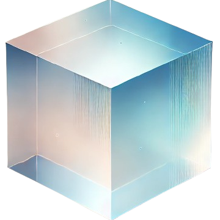

<h1 align="center">A launcher for NF Client (Fabric)</h1>

<em><h5 align="center">(formerly Electron Launcher)</h5></em>

모드가 적용된 클라이언트를 쉽고 빠르게 실행할 수 있습니다!

## 다운로드

여기서 다운로드할 수 있습니다: [GitHub Releases](https://github.com/dscalzi/HeliosLauncher/releases)

**지원되는 플랫폼**

[Releases](https://github.com/dscalzi/HeliosLauncher/releases) 탭에서 다운로드할 경우, 플랫폼을 선택해서 다운받으세요!

| Platform | File |
| -------- | ---- |
| Windows x64 | `Helios-Launcher-setup-VERSION.exe` |
| macOS x64 (Intel) | `Helios-Launcher-setup-VERSION-x64.dmg` |
| macOS arm64 (Apple Silicon) | `Helios-Launcher-setup-VERSION-arm64.dmg` |
| Linux x64 | `Helios-Launcher-setup-VERSION.AppImage` |

---

## Resources

* [Wiki][wiki]
* [Nebula (Create Distribution.json)][nebula]
* [v2 Rewrite Branch (Inactive)][v2branch]

[nodejs]: https://nodejs.org/en/ 'Node.js'
[vscode]: https://code.visualstudio.com/ 'Visual Studio Code'
[mainprocess]: https://electronjs.org/docs/tutorial/application-architecture#main-and-renderer-processes 'Main Process'
[rendererprocess]: https://electronjs.org/docs/tutorial/application-architecture#main-and-renderer-processes 'Renderer Process'
[chromedebugger]: https://marketplace.visualstudio.com/items?itemName=msjsdiag.debugger-for-chrome 'Debugger for Chrome'
[discord]: https://discord.gg/zNWUXdt 'Discord'
[wiki]: https://github.com/dscalzi/HeliosLauncher/wiki 'wiki'
[nebula]: https://github.com/dscalzi/Nebula 'dscalzi/Nebula'
[v2branch]: https://github.com/dscalzi/HeliosLauncher/tree/ts-refactor 'v2 branch'
